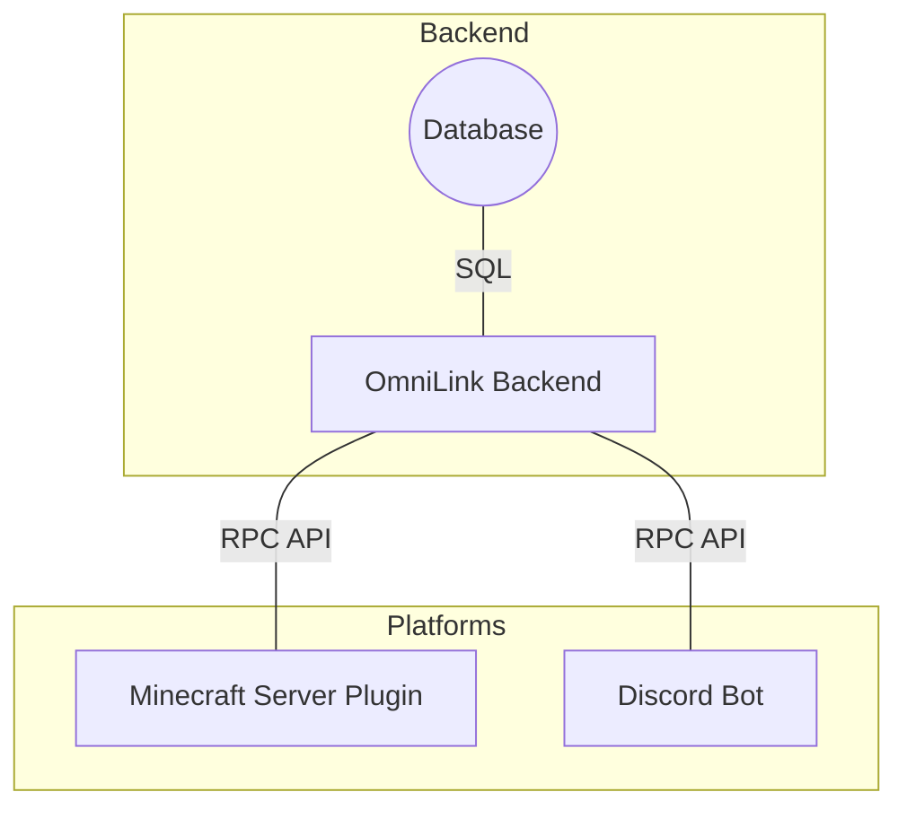

# OmniLink Account Management

## Architecture

The system is comprised of a central backend service, which is storing account relationships, and a separate number of integration services, which are responsible for interfacing with their respective platforms (Minecraft, Discord, etc.).

Minecraft is designed to be the primary initiating platform for account linking, all other platforms are external verification services, which only respond to verification tokens.

The OmniLink profile is the primary canonical account model, which is linked to all other platform accounts. There is no persistent prioritisation of identities at all. Only current session context exists, and that context is already owned by the originating platform (Minecraft or Discord), and is not needed by the OmniLink backend. The OmniLink backend is only responsible for storing relationships between accounts, and verifying that a given token is valid for a given account.

OmniLink IS NOT a session authority or authentication provider, it does not manage sessions, and does not provide any authentication services. It is only responsible for linking accounts across platforms.

## Minecraft linking

### Minecraft Player A

`/profile link minecraft <Java/Floodgate username>`

-> Returns verification token

- Floodgate already ensures Bedrock/Java usernames do not clash!

### Minecraft Player B

`/verify <token>`

## Discord linking

### On Minecraft

`/profile link discord`

-> Returns verification token

### On Discord

A bot registers a command on the Discord server,

the user simply performs `/verify <token>`

Discord never initiates a link request, it only responds to a verification token.

## Commands

- `/profile link <platform> <username>` - Links your account to the specified platform (Minecraft, Discord, etc.) and returns a verification token. **(Implemented only by the Minecraft integration)**
- `/verify <token>` - Verifies your account with the provided token. **(Implemented by both Minecraft and Discord integrations)**

## Tokens

Tokens need to be human readable, use Base32/Crockford encoding, and be at least 8 characters long. They should be unique and expire quickly after a 5-minute window. The system should be able to handle multiple tokens per user, as they may request a new token if they fail to verify in time.
