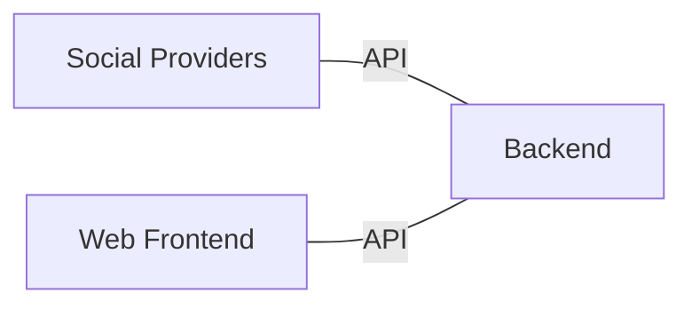

# OmniLink Architecture

OmniLink follows the principles of a microservices architecture, where each platform integration is implemented as a separate service. The OmniLink backend serves as the central hub for account linking and management, while the web frontend provides a user-friendly interface for users to link and manage their accounts.

## Rules

### Rule 1: Not an authentication provider

OmniLink is not an authentication provider, it does not manage sessions, and does not provide any authentication services. It is only responsible for linking accounts across platforms.

### Rule 2: Always use IDs, never usernames

Usernames are not unique and can change over time. Therefore, OmniLink always uses unique identifiers (IDs) to link accounts across platforms. For example, in Minecraft, the unique identifier is the UUID, while in Discord, it is the user ID.

## Models

### Profile

A profile is the canonical global representation of a user. It is the source of truth for all account relationships. A profile is created when a user first links an account, and it is never deleted. Profiles are identified by a UUID, and contain the following information:

- `id` PK (uuid): The unique identifier for the profile.
- `username` (string): The username of the user.
- `created_at` (timestamp): The timestamp when the profile was created.
- `updated_at` (timestamp): The timestamp when the profile was last updated.

### Tokens

A token is a short-lived, unique string that is used to link accounts across platforms. Tokens are generated by the OmniLink system and are associated with a specific profile. They are used to verify that a user owns both accounts before linking them together.

Tokens need to be human readable, use Base32/Crockford encoding, and be at least 8 characters long. They should be unique and expire quickly after a 5-minute window. The system should be able to handle multiple tokens per user, as they may request a new token if they fail to verify in time.

A token contains the following information:

- `id` PK (uuid): The unique identifier for the token.
- `token` (string): The unique token string.
- `profile_uuid` FK (uuid): The UUID of the profile associated with the token.
- `created_at` (timestamp): The timestamp when the token was created.
- `expires_at` (timestamp): The timestamp when the token will expire.
- `used` (boolean): A flag indicating whether the token has been used to link accounts.
- `used_at` (timestamp): The timestamp when the token was used to link accounts, if applicable.
- `target_platform` (string): The platform for which the token is intended (e.g., "minecraft", "discord").
- `target_account_id` (optional string): The account ID on the target platform that the token is intended to link to. This field is optional and may be null if the account ID is not known at the time of token creation.

### Account

An account is a representation of a user's identity on a specific platform. Each account is associated with a profile and contains the following information:

- `id` PK (uuid): The unique identifier for the account.
- `platform` (string): The name of the platform (e.g., "minecraft", "discord").
- `platform_id` (string): The unique identifier for the account on the platform (e.g., UUID for Minecraft, user ID for Discord).
- `profile_uuid` FK (uuid): The UUID of the profile associated with the account.
- `created_at` (timestamp): The timestamp when the account was created.
- `updated_at` (timestamp): The timestamp when the account was last updated.
